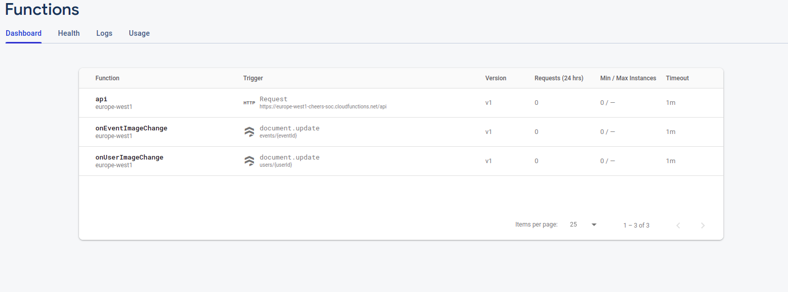
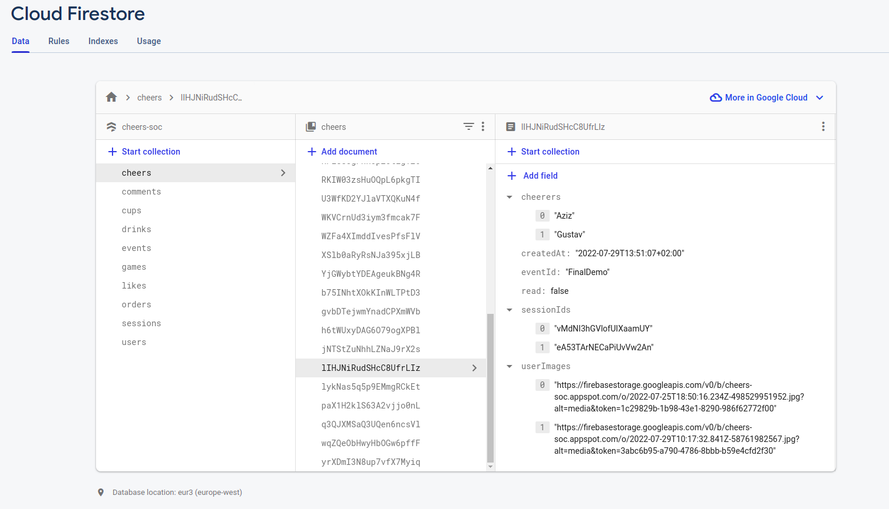
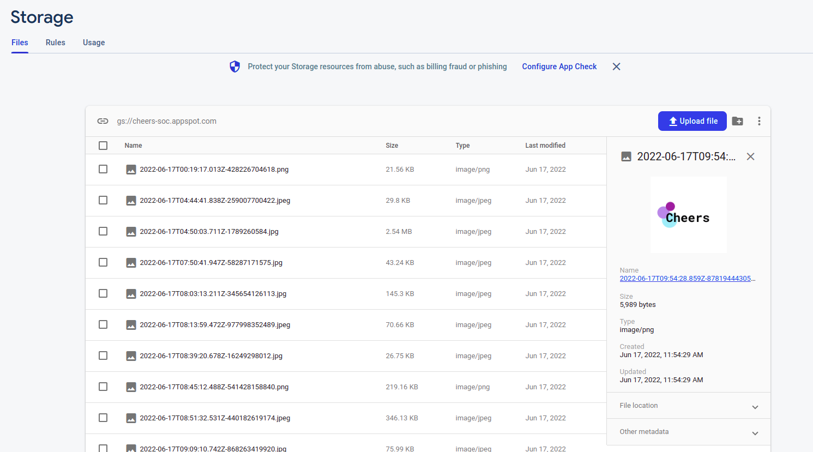

# Cloud Backend

The backend of the cloud service provides several functions in Node js which are deployed on a firebase server allowing any customer or event organizer to access and upload data at any time via the [API](https://europe-west1-cheers-soc.cloudfunctions.net/api). 

The user authentication was tracked and secured with the Firebase Authentication functionality. 

The database and the triggers were handled using Cloud Firestore,

and the images were saved in the Firebase Storage.

By subscribing to the [Firebase Blaze plan](https://firebase.google.com/pricing) it is possible to have several thousands of requests issued everyday and to integrate modules which need a lot of computational resources such as the face detection. 

## I- Gateway API endpoints: 
### 1- Sessions
- `POST /event/:eventId/open` 
```
Body:
{
      "userHandle": String
}
```
Creating or pulling a session for a user using the username and the eventId. The session consists of all the information The function is called when a user asks for a cup.
      
- `POST /event/:eventId/update` 
```
Body:
{
  "sessionId":String,
  "cheers":[
    {
      "sessionIdOfCheer":String,
      "time":[String]
    }
  ],
  "orders":[
    {
      "order":String,
      "time":[String]
    }
  ],
  "promille":Double,
  "score":String,
  "rank":Int
}
```

Updating the cheers, orders, score, alcohol percentage, bill and calories of a user. This function is used by the bartender to update the user information while the cup is still used.
      
- `POST /event/:eventId/close`
```
Body:
{
  "sessionId":String,
  "cheers":[
    {
      "sessionIdOfCheer":String,
      "time":[String]
    }
  ],
  "orders":[
    {
      "order":String,
      "time":[String]
    }
  ],
  "promille":Double,
  "score":String,
  "rank":Int
}
```
Closing the session and updating it.
      
- `GET /event/:eventId/user/:userHandle` 
      The gateway can request informations about the user for identity confirmation.
- `POST /event` 
```
Body:
{
  "eventName": String,
  "description": String
}
```
Create a new event.
      
### 2- Games
- `POST /event/:eventId/game/players` 
```
Body:
{
  "donePlayers": [String]
}
```
Used to fetch all the players of the GuessWho game which have not been set as a target yet.


## II- Frontend API endpoints: 
### 1- Authentication
- `POST /signup` 
```
Body:
{
  "email": String,
  "password": String
}
```
Used to sign up a user using the Firebase authentication functionality.
- `POST /login` 
```
Body:
{
  "email": String,
  "password": String
}
```
Used to login a user by sending a bearer token after confirmation of the correct credentials.
    
### 2- Users
- `GET /user | Authentication: Bearer token` 
      Returns all the details of the authenticated user.
- `GET /users | Authentication: Bearer token` 
      Returns a list of all the users which have cheered with the authenticated user.
- `GET /user/:handle` 
      Returns the profile of a specific user.
- `POST /user` 
```
Body:
{
  "bio": String,
  "facebook": String,
  "instagram": String,
  "phone": String,
  "twitter": String,
  "linkedin": String,
  "location": String,
  "website": String
}
Authentication: Bearer token
```
Update the details of the authenticated user.
- `POST /user/image` 
```
Form:
      image: png/jpg/jpeg
Authentication: Bearer token
```
Update the profile picture of the authenticated user.

### 3- Events
- `GET /session/:sessionId | Authentication: Bearer token`  
  Return all the informations related to a session which the authenticated user was registered forincluding cheers, orders, bill, alcohol perentage, calories and score
- `POST /game/blur` 
```
Form:
      image: png/jpg/jpeg
      sessionId: String
Authentication: Bearer token
```
Allows the authenticated user to take part in the Guess Who game by uploading an image. The function uses a face detection method and an image editing module to hide the identity of the players, which means that every player needs to provide a picture with a clearly visible face.
- `GET /event/:eventId/like | Authentication: Bearer token` 
  Increment the number of likes of an event if not already liked by the authenticated user.
- `GET /event/:eventId/unlike | Authentication: Bearer token` 
  Decrement the number of likes of an event if already liked by the authenticated user.
- `GET /event/:eventId | Authentication: Bearer token` 
  Return all the details about an event including the comments.
- `POST /event/:eventId/comment`
```
Body:
{
  "body": String,
}
Authentication: Bearer token
``` 
  An authenticated user can share a public comment with all the people which are taking part in it. 
## III- Cloud Firestore triggers: 
- `onEventImageChange`
  Triggers updates to all the references to the profile picture of a player in the database once it is modified.
- `onUserImageChange`
  Triggers updates to all the references to the picture of an event in the database once it is modified.
