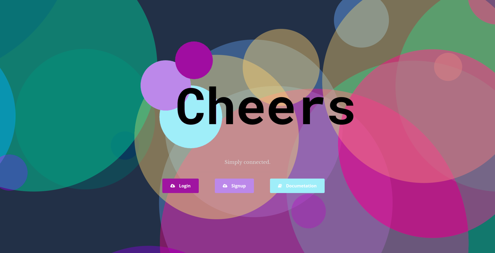
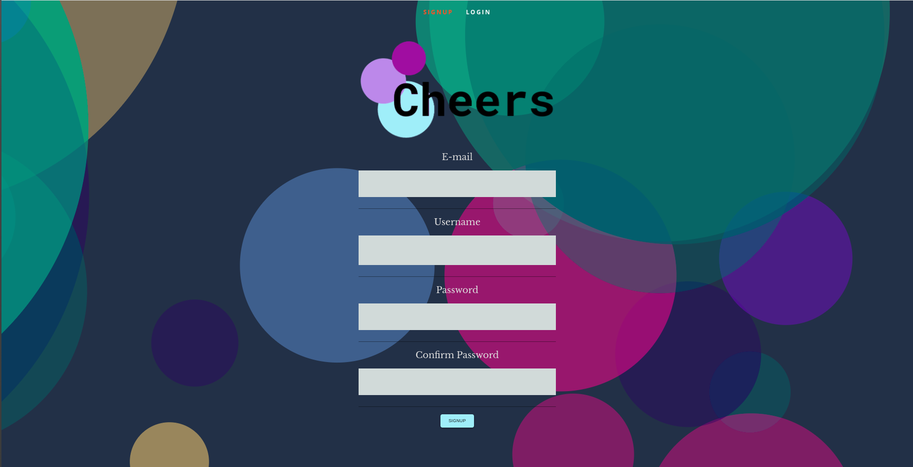
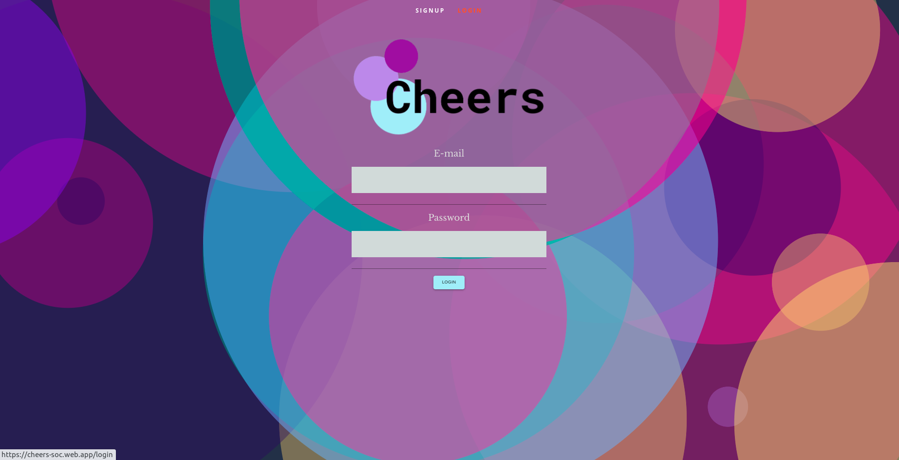
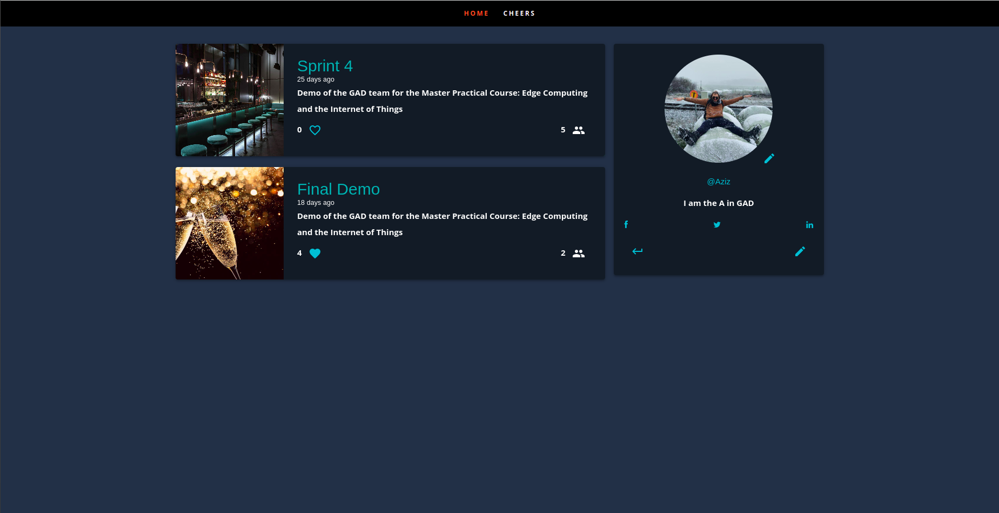
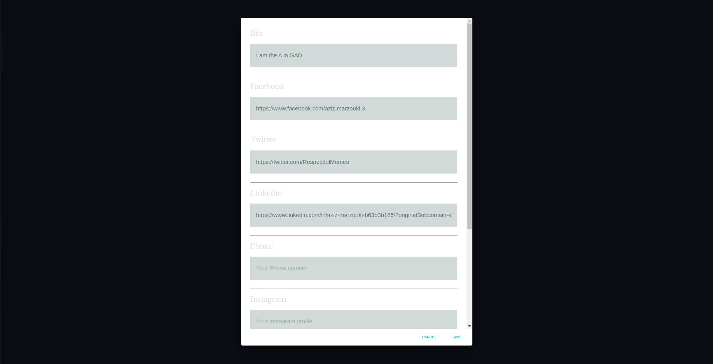
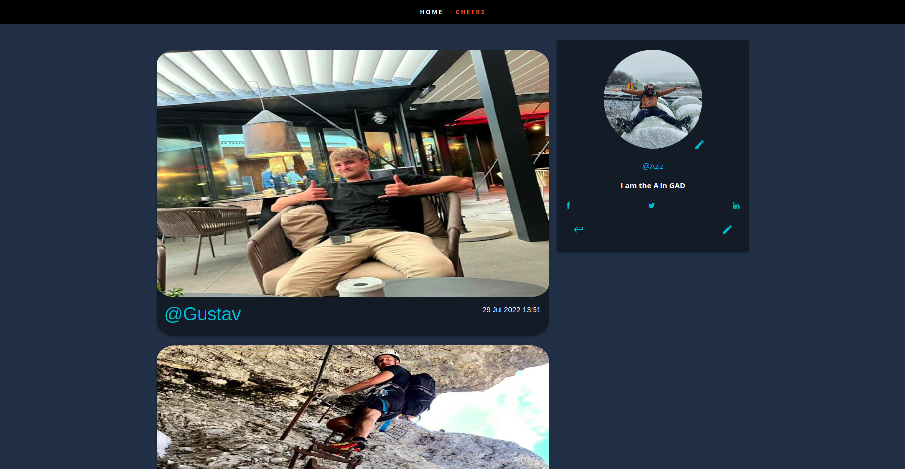
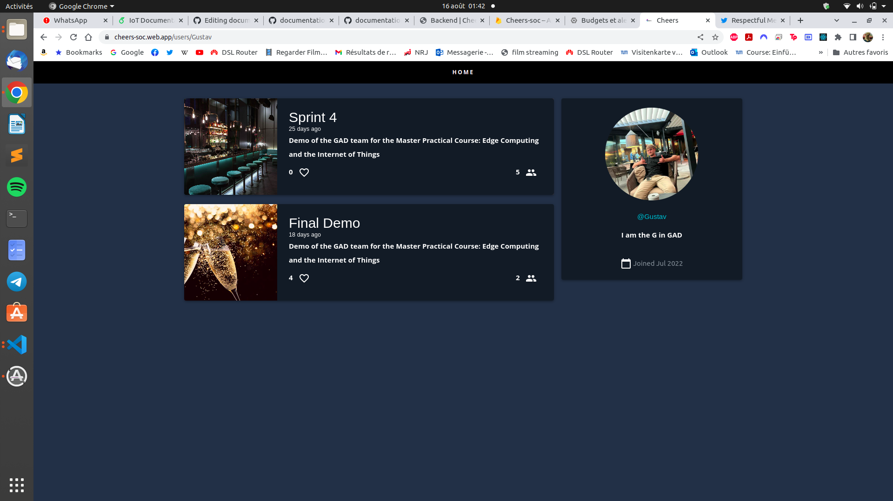
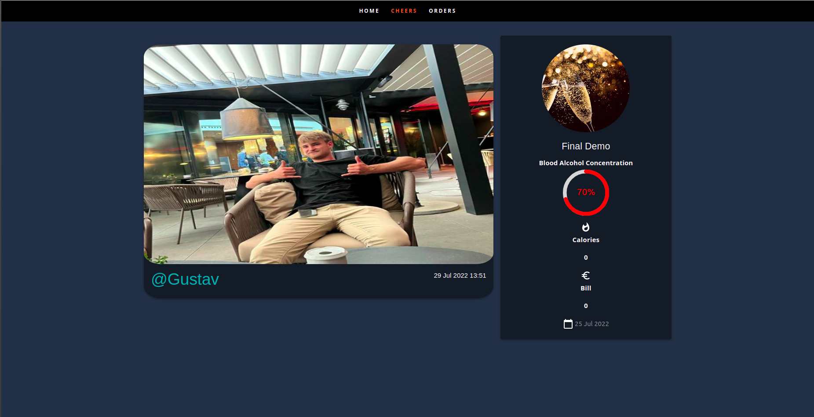
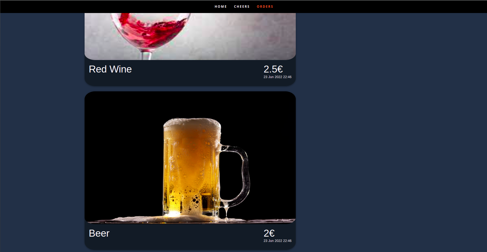
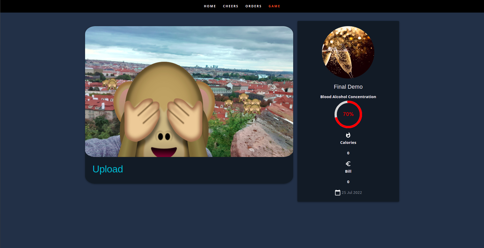

# Cloud Frontend

The website is accessible [here](https://cheers-soc.web.app/).For it to work properly, the Firebase [API](https://europe-west1-cheers-soc.cloudfunctions.net/api) (See [Backend documentation](https://team-gad.github.io/documentation/docs/gateway/backend/)) needs to be properly deployed with correct database entries.
## Landing Page

This page displays buttons to reach signup, login and documentation pages.
### Signup

The user can type a unique username as well as an adequate e-mail address and password. 
Following api calls are required:
- `POST /signup` 
### Login

The user can type his/her e-mail address and his/her password to access his/her content. 
Following api calls are required:
- `POST /login` 
## Home Page

This page dislays all the events that a user attended with the corresponding like buttons and counts, and user counts on the left. By clicking on the name of an event the user can access the session page. On the right, we find the profile of the user with the details and image he uploaded.By clicking on the pencil icon the user can edit his profile and picture and by clicking on the arrow he can log out.
Following api calls are required:
- `GET /user` 
- `POST /user/image`
- `GET /event/:eventId/like`
- `GET /event/:eventId/unlike` 
### Profile editing

The user can edit his profile by changing the text values in the corresponding field.
Following api calls are required:
- `POST /user`
### Cheers

This page displays the list of all the other user the authenticated user has cheered with.
Following api calls are required:
- `GET /users`
## User Page

The following page displays the information of a user that the authenticated user has cheered with.
Following api calls are required:
`GET /user/:handle`
## Session Page
The following page displays all the information collected during a session at an event.
Following api calls are required:
- `GET /session/:sessionId` 
### Cheers

The user sees the list of the persons he cheered with during the session. By clicking on the name, the user can access the profile of that person.
Following api calls are required:
`GET /user/:handle`
### Orders

The user has a list of all his orders during the session.
### Game

Once the Organizer has started the GuessWHo game, the user can choose to participate by uploading a picture where his face is clearly displayed.
Following api calls are required:
- `POST /game/blur`

