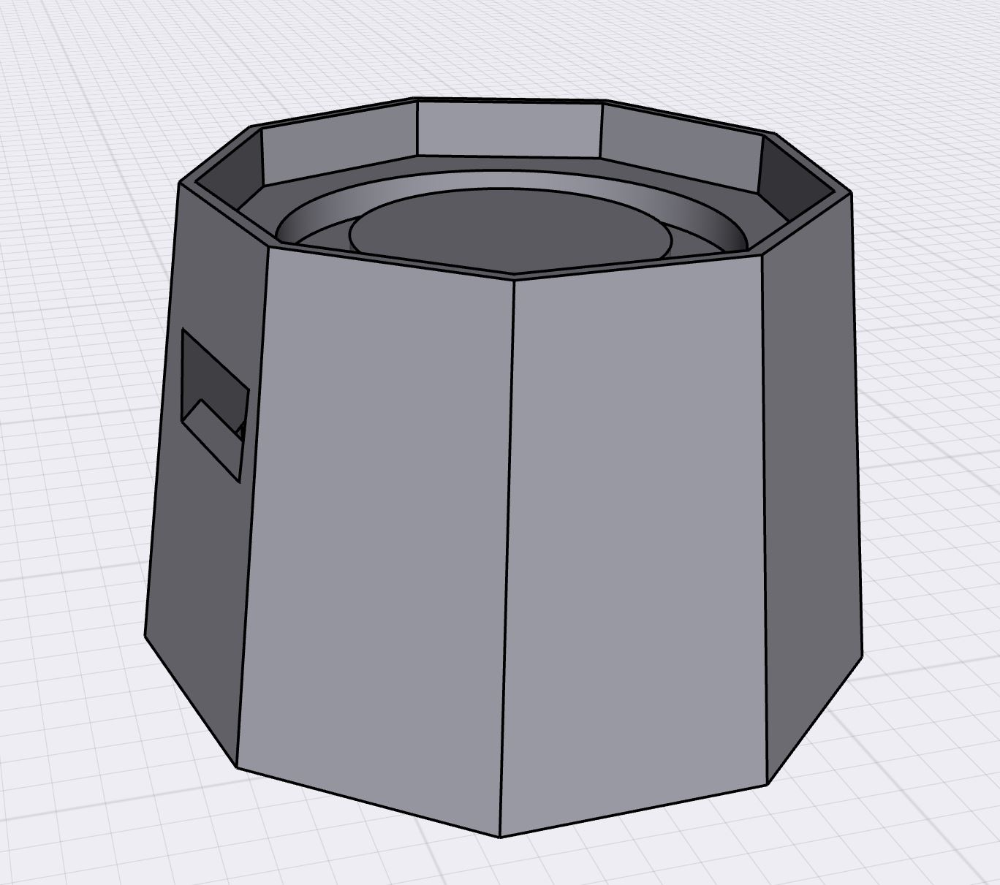

# 3D Prints

To keep all the hardware protected and attached to the glass, 
a 3D printed case was developed. 
There have been several iterations of it, 
all of them can be found on GitHub. 
The final goal of the case is to be as small as possible and waterproof.

## Current Version

- Download [MF File](https://github.com/Team-GAD/smart-cup/raw/main/hardware/3D%20case/Case_v4.3mf)
- Download [Shapr File](https://github.com/Team-GAD/smart-cup/raw/main/hardware/3D%20case/Case_v4.shapr)
- Download [GCode](https://github.com/Team-GAD/smart-cup/raw/main/hardware/3D%20case/Case_v4.gcode)

