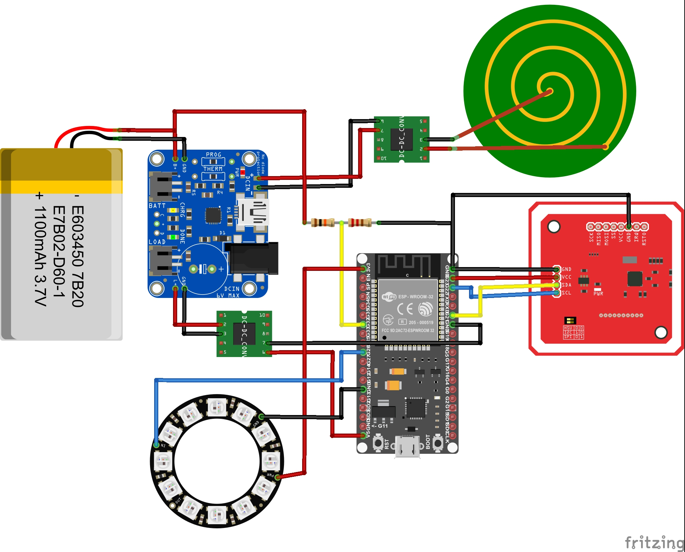

# Hardware

Here, the individual components that were used are listed and described
why they were used.

But first, let's look at the entire wiring. 
Everything must be wired as shown in the following diagram so that it 
works with the current software. If other input and output pins are used, 
this must be changed accordingly in the software of the Cup.   

# Used components:

- **ESP32:**
The central element of the system is the ESP32, 
it controls all components and communicates with the gateway

- **NFC Module:**
The PN532 module was used as the NFC module. It has several modes but in this system it 
is only used in I2C mode for P2P communication.

- **LED Ring:**
  The LED ring from Adafruit with 12 individual LEDs was used.

- **Battery:**
A LiPo battery with 1100 mA was used, it has an output voltage between 3.3 and 4.2 V and 
supplies the EPS32 with power. 
To extend the battery life, a battery with more mA could also be used as 
long as it has the same output voltage.

- **Battery Board:**
For charging the battery you need a charger board. 
In this project the LiPo charger from Adafruit was used.

- **Charging Coil:**
The entire case should be closed in the final product, so an induction charger 
was installed so that the battery can still be charged without having to disassemble the cup again.

- **DC to AC Module:**
Since the induction charger outputs AC, but our system works with DC, the current must first be converted. 
For this we use the AC to DC converter used

- **Step Up Module:**
The used battery works with an output voltage of 3,7 V but the ESP32 works with a voltage of 5V therefore 
the Step-Up module is used to supply the ESP properly.

- **Resistors:**
To find out how much the battery is still charged we measure its output current. If it is fully charged it has an output current of 4.2 V and if it is empty 3.2. 
The resistors are used to measure this current with the ESP32. 
