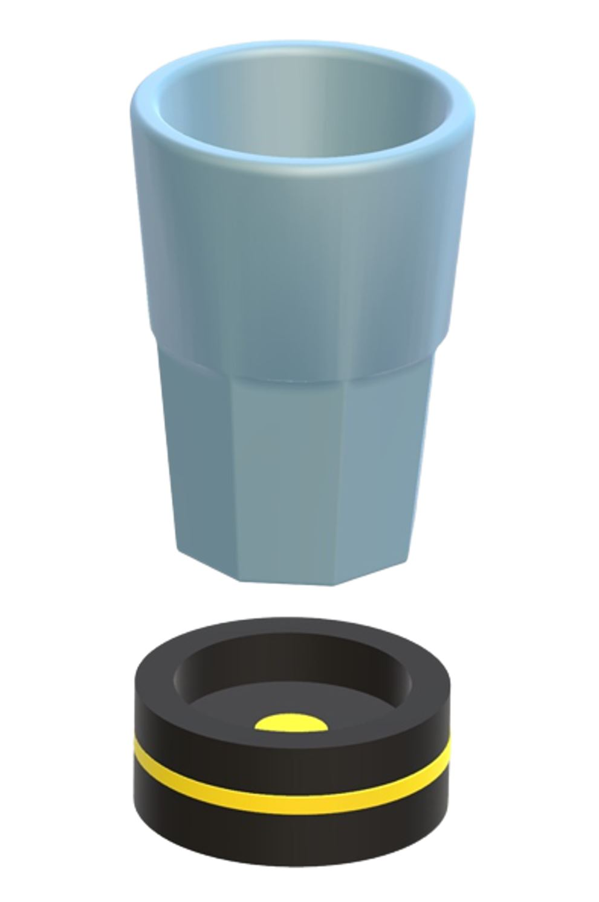

## Cup Description

To make a Cup smart it needs several hardware components as well as self-written software. 
In this section, the hardware used, how it must be connected to each other, 
and the software written in Arduino will be described in more detail.

